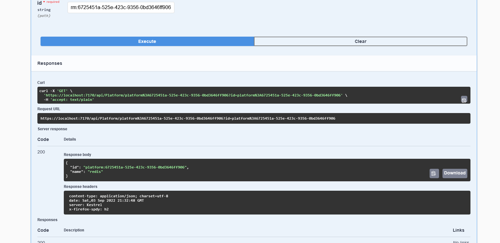

# .NET-CORE-with-Redis-in-Docker-DEMO

## Demo for applying .net Core with Redis as Primary storage

## Pre-requisite

#### VS CODE
#### .NET CORE 6
#### Docker Desctop with account in Docker-Hub
#### using 'dotnet add package Microsoft.Extensions.Caching.StackExchangeRedis --version 7.0.0-preview.7.22376.6' for redis 
####  docker build -t redisapi .
####  docker run redisapi

